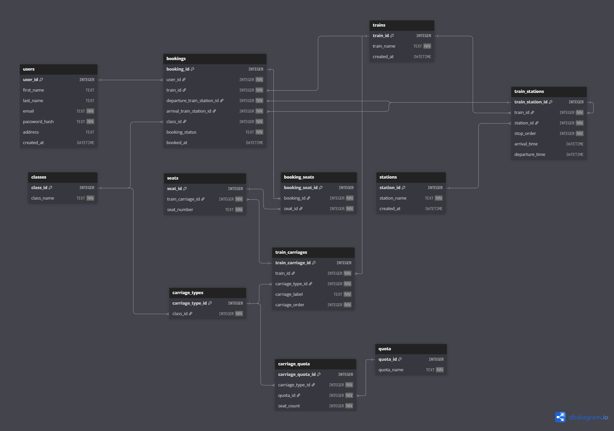

# [Draft] Database Schema

> **Note**
> For full interactivity (table relationships, references, and navigation),
> open the DBML file directly in **https://dbdiagram.io**.
>
> The diagram image below is a static representation for quick reference.

---

## Database Diagram



---

## DBML Source Code

```dbml
Project booking_project {
  database_type: 'SQLite'
  Note: '''
  Train booking system.

  Core principles:
  - Carriage numbering is train-specific (S1, A1, etc.)
  - Carriage layout is defined by reusable templates
  - Quota and seat allocation are managed separately
  - Seat availability is segment-based and derived from bookings
  - No seat-level availability/status column is stored
  '''
}

Table users {
  user_id INTEGER [pk, increment]
  first_name TEXT
  last_name TEXT
  email TEXT [not null, unique, note: 'Primary login identifier']
  password_hash TEXT [not null, note: 'Hashed password only']
  address TEXT
  created_at DATETIME

  Note: '''
  Application users who can make bookings.
  '''
}

Table trains {
  train_id INTEGER [pk, increment]
  train_name TEXT [not null]
  created_at DATETIME

  Note: '''
  Represents a physical train service.
  '''
}

Table classes {
  class_id INTEGER [pk, increment]
  class_name TEXT [not null, note: 'Sleeper, 2A, 3A, CC, etc.']

  Note: '''
  Logical travel class.
  Used for pricing, quota, and carriage layout.
  Not a physical carriage.
  '''
}

Table carriage_types {
  carriage_type_id INTEGER [pk, increment]
  class_id INTEGER [not null, ref: > classes.class_id]

  Note: '''
  Reusable carriage template.
  Represents the structure/layout of a carriage for a class.
  Seat counts are defined per quota via carriage_quota.
  '''
}

Table quota {
  quota_id INTEGER [pk, increment]
  quota_name TEXT [not null, note: 'General, Tatkal, etc.']

  Note: '''
  Reservation quota category.
  Used to control seat distribution and availability.
  '''
}

Table carriage_quota {
  carriage_quota_id INTEGER [pk, increment]
  carriage_type_id INTEGER [not null, ref: > carriage_types.carriage_type_id]
  quota_id INTEGER [not null, ref: > quota.quota_id]
  seat_count INTEGER [not null]

  Note: '''
  Defines how many seats of a carriage type
  are allocated to a specific quota.
  '''
}

Table train_carriages {
  train_carriage_id INTEGER [pk, increment]
  train_id INTEGER [not null, ref: > trains.train_id]
  carriage_type_id INTEGER [not null, ref: > carriage_types.carriage_type_id]

  carriage_label TEXT [not null, note: 'Train-specific label like S1, A1']
  carriage_order INTEGER [not null, note: 'Physical position in the train']

  indexes {
    (train_id, carriage_label) [unique]
    (train_id, carriage_order) [unique]
  }

  Note: '''
  Physical carriage instance attached to a train.
  Multiple carriages can share the same carriage_type.
  Numbering belongs to the train, not the class.
  '''
}

Table seats {
  seat_id INTEGER [pk, increment]
  train_carriage_id INTEGER [not null, ref: > train_carriages.train_carriage_id]
  seat_number TEXT [not null]

  indexes {
    (train_carriage_id, seat_number) [unique]
  }

  Note: '''
  Physical seat inside a train carriage.
  No availability or booking status stored here.
  '''
}

Table stations {
  station_id INTEGER [pk, increment]
  station_name TEXT [not null, unique]
  created_at DATETIME

  Note: '''
  Railway stations.
  '''
}

Table train_stations {
  train_station_id INTEGER [pk, increment]
  train_id INTEGER [not null, ref: > trains.train_id]
  station_id INTEGER [not null, ref: > stations.station_id]

  stop_order INTEGER [not null, note: 'Defines the travel sequence of stations']
  arrival_time DATETIME
  departure_time DATETIME

  indexes {
    (train_id, stop_order) [unique]
  }

  Note: '''
  Defines the route of a train.
  stop_order is used to validate journey segments
  and compute overlapping bookings.
  '''
}

Table bookings {
  booking_id INTEGER [pk, increment]
  user_id INTEGER [not null, ref: > users.user_id]
  train_id INTEGER [not null, ref: > trains.train_id]

  departure_train_station_id INTEGER [not null, ref: > train_stations.train_station_id]
  arrival_train_station_id INTEGER [not null, ref: > train_stations.train_station_id]

  class_id INTEGER [not null, ref: > classes.class_id]
  booking_status TEXT [not null, note: 'PENDING | CONFIRMED | CANCELLED']
  booked_at DATETIME

  Note: '''
  Represents a booking intent for a journey segment.
  Does not directly store seat information.
  '''
}

Table booking_seats {
  booking_seat_id INTEGER [pk, increment]
  booking_id INTEGER [not null, ref: > bookings.booking_id]
  seat_id INTEGER [not null, ref: > seats.seat_id]

  indexes {
    (booking_id, seat_id) [unique]
  }

  Note: '''
  Links seats to bookings.
  Seat availability is determined by checking
  overlapping journey segments in this table.
  '''
}


Ref: "train_stations"."train_station_id" < "train_stations"."train_id"